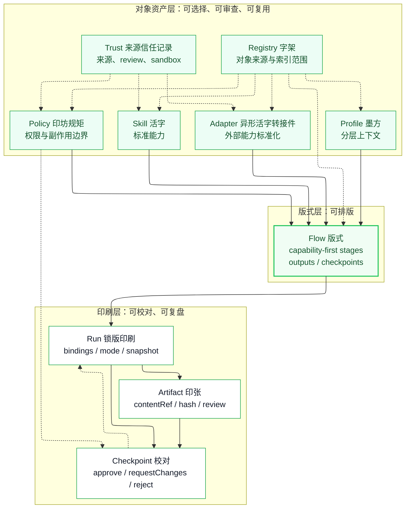

Huoban 的第一张架构图不应该画成 runtime、server、worker 或数据库拓扑。Huoban 当前是 standard-first、runtime-later：它首先定义 AI 原生工作的对象语言。

这张图表达的是 Huoban 活板的设计哲学：从可复用对象，到可排版 Flow，再到可校对、可复盘的 Run / Checkpoint / Artifact。

## 读图方式

<CardGroup cols={3}>
  <Card title="对象资产层" icon="boxes" type="tip" color="#16A34A">
    `Skill`、`Adapter`、`Profile`、`Policy`、`Registry` 和 `Trust` 是可复用、可选择、可审查的对象资产。
  </Card>
  <Card title="版式层" icon="route" type="tip" color="#16A34A">
    `Flow` 把 capability、上下文、行为边界、产物预期和 checkpoint 排成可复用版式。
  </Card>
  <Card title="印刷层" icon="print" type="tip" color="#16A34A">
    `Run` 锁定一次执行视图，`Artifact` 留下印张，`Checkpoint` 把校对变成对象。
  </Card>
</CardGroup>

## 关键边界

| 边界 | 含义 |
| --- | --- |
| `Registry` 只发现对象 | 它不选择对象、不证明对象可信、不托管对象。 |
| `Trust` 不等于权限 | 它记录来源信任；是否允许副作用仍由 `Policy` 判断。 |
| `Flow` 不是执行器 | 它声明版式；具体绑定进入 `Run`。 |
| `Run` 不是 runner | 它记录一次锁定执行视图、状态、产物引用和观察事实。 |
| `Checkpoint` 不保存产物正文 | 它引用 `Artifact` 并承载决策边界。 |
| `Artifact` 不是文件系统 | 它保存产物元数据、内容引用、hash 和 review 状态。 |

## 为什么不是运行时架构图

Kubernetes 的经典架构图适合表达 control plane、worker node 和集群组件。Huoban 现在不应该照着画 runtime 拓扑，因为这会误导成“Huoban 是一个执行平台”。

Huoban 的核心是对象模型：把 AI 工作拆成可验证、可组合、可审查的标准对象。runtime、hosted registry、marketplace 和完整执行系统可以以后围绕这些对象实现，但不是这张图要表达的第一性结构。
